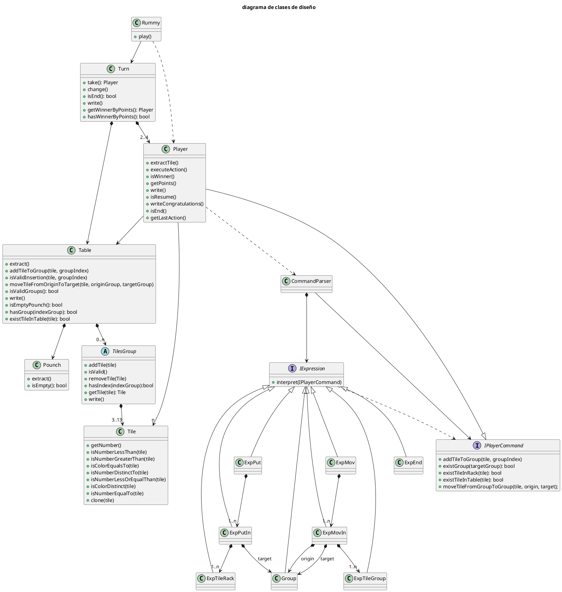

```plantuml
@startuml
title diagrama de clases de diseño

class Rummy {
  +play()
}

Rummy --> Turn
Turn *--> Table
Turn *--> "2..4" Player
Table *--> Pounch
Table *--> "0..n" TilesGroup
Player --> Table
Player --> "n" Tile

Rummy ..> Player

class Turn {
   +take(): Player
   +change()
   +isEnd(): bool
   +write()
   +getWinnerByPoints(): Player
   +hasWinnerByPoints(): bool
}

class Table {
  +extract()
  +addTileToGroup(tile, groupIndex)
  +isValidInsertion(tile, groupIndex)
  +moveTileFromOriginToTarget(tile, originGroup, targetGroup)
  +isValidGroups(): bool
  +write()
  +isEmptyPounch(): bool
  +hasGroup(indexGroup): bool
  +existTileInTable(tile): bool
}

class Pounch {
  +extract()
  +isEmpty(): bool
}

class Player {
  +extractTile()
  +executeAction()
  +isWinner()
  +getPoints()
  +write()
  +isResume()
  +writeCongratulations()
  +isEnd()
  +getLastAction()
}

abstract class TilesGroup {
   +addTile(tile)
   +isValid()
   +removeTile(Tile)
   +hasIndex(indexGroup):bool
   +getTile(tile): Tile
   +write()
}

class Tile {
  +getNumber()
  +isNumberLessThan(tile)
  +isNumberGreaterThan(tile)
  +isColorEqualsTo(tile)
  +isNumberDistinctTo(tile)
  +isNumberLessOrEqualThan(tile)
  +isColorDistinct(tile)
  +isNumberEqualTo(tile)
  +clone(tile)
}

TilesGroup *--> "3..13" Tile

Player ..> CommandParser
interface IExpression {
   +interpret(IPlayerCommand)
}
CommandParser *--> IExpression

IExpression <|-- ExpPut
IExpression <|-- ExpMov
IExpression <|-- ExpEnd

ExpPut *--> "1..n" ExpPutIn
ExpMov *--> "1..n" ExpMovIn

ExpMovIn *--> Group: origin
ExpMovIn *--> Group: target
ExpPutIn *--> "1..n" ExpTileRack
ExpPutIn *--> Group: target

IExpression <|-- ExpPutIn
IExpression <|-- ExpTileRack
IExpression <|-- Group
IExpression <|-- ExpMovIn
IExpression <|-- ExpTileGroup

ExpMovIn *--> "1..n" ExpTileGroup

IPlayerCommand <|-- Player
CommandParser --> IPlayerCommand
IExpression ..> IPlayerCommand

interface IPlayerCommand {
  +addTileToGroup(tile, groupIndex) 
  +existGroup(targetGroup): bool
  +existTileInRack(tile): bool
  +existTileInTable(tile): bool
  +moveTileFromGroupToGroup(tile, origin, target);
}
@enduml
```